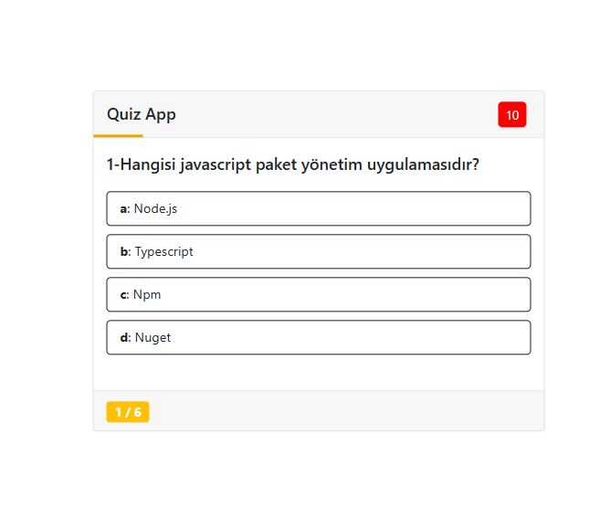
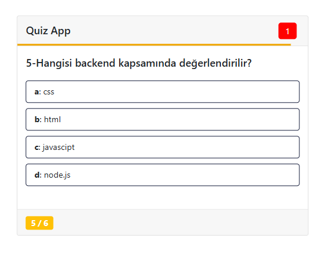
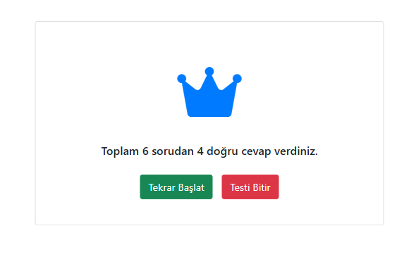

# JavaScript Quiz Application

This is a JavaScript-based quiz application designed to test knowledge on various JavaScript concepts and related technologies. The application dynamically generates questions and evaluates user responses, providing immediate feedback.

---

## Features

- **Dynamic Questions**: Questions are created dynamically using JavaScript objects.
- **Interactive UI**: Users can select answers and get immediate feedback on correctness.
- **Customizable Questions**: Easily add or modify questions in the `soru.js` file.

---

## File Structure

```
JS-Quiz/
|-- .vscode/
|-- index.html
|-- quiz.js
|-- script.js
|-- soru.js
|-- style.css
|-- ui.js
|-- .gitattributes
|-- README.md
```

### Key Files

- **index.html**: The main HTML file that structures the quiz application's interface.
- **style.css**: Contains the styling for the application, ensuring a visually appealing layout.
- **soru.js**: Contains the questions in the form of JavaScript objects.
- **quiz.js**: Handles the quiz logic, including scoring and question navigation.
- **script.js**: Coordinates the UI and logic, tying everything together.
- **ui.js**: Manages the rendering of elements in the user interface.

---

## How to Use

1. Clone the repository:
   ```bash
   git clone https://github.com/<your-username>/js-quiz.git
   ```

2. Navigate to the project directory:
   ```bash
   cd js-quiz
   ```

3. Open the `index.html` file in your browser to launch the quiz application.

---

## Screenshots

### Example Quiz Question





---

## Adding New Questions

To add new questions, open the `soru.js` file and use the following format:

```javascript
new Soru("Question text here", 
    { a: "Option A", b: "Option B", c: "Option C", d: "Option D" }, 
    "correctAnswer"
),
```

For example:

```javascript
new Soru("What is the capital of France?", 
    { a: "Berlin", b: "Madrid", c: "Paris", d: "Rome" }, 
    "c"
),
```

---

## Contribution Guidelines

Contributions are welcome! You can help by:

- Adding new questions.
- Improving the UI/UX.
- Fixing bugs or enhancing the quiz logic.

To contribute:
1. Fork the repository.
2. Create a new branch for your changes.
3. Submit a pull request with a clear description of your changes.

---


